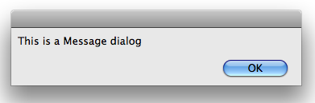
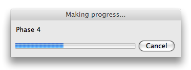
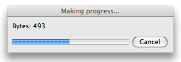
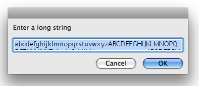
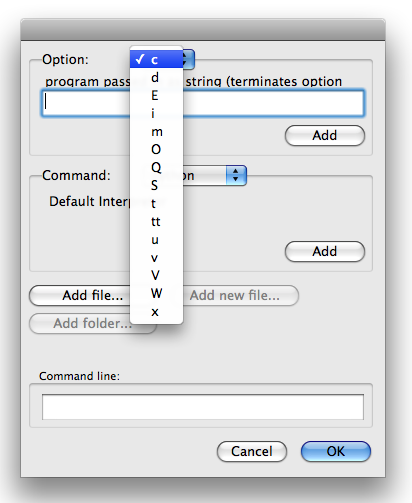
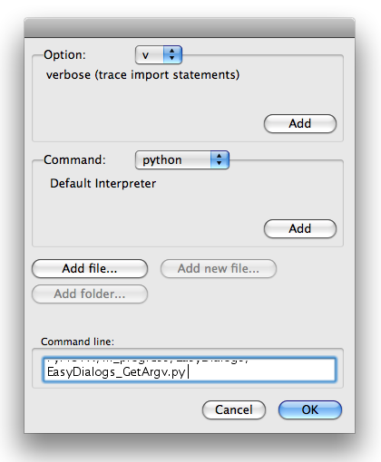

..
    ==========================================
    EasyDialogs -- Carbon dialogs for Mac OS X
    ==========================================

================================================
EasyDialogs -- Mac OS X 向けの Carbon ダイアログ
================================================

..
    :synopsis: Provides simple interfaces to Carbon dialogs from Python.

.. module:: EasyDialogs
    :synopsis: Python から Carbon ダイアログのシンプルなインタフェースを提供する

..
    :Purpose: Provides simple interfaces to Carbon dialogs from Python.
    :Available In: At least 2.0, Macintosh-only (see References below for a Windows implementation)

:目的: Python から Carbon ダイアログのシンプルなインタフェースを提供する
:利用できる バージョン: 2.0 以上、マッキントッシュのみ(Windows の実装は以下のリファレンスを参照)

..
    The EasyDialogs module includes classes and functions for working with
    simple message and prompt dialogs, as well as stock dialogs for
    querying the user for file or directory names. The dialogs use the
    Carbon API. See Apple's `Navigation Services Reference`_ for more
    details about some of the options not covered in detail here.

:mod:`EasyDialogs` モジュールは、ファイルやディレクトリ名をユーザーに尋ねる普通のダイアログと同様に、シンプルなメッセージとプロンプトダイアログで動作するクラスや関数を提供します。このダイアログは Carbon API を使用します。この記事で説明しないオプションの詳細は Apple の `Navigation Services Reference`_ を参照してください。

..
    Messages
    ========

メッセージ
==========

..
    A simple Message function displays modal dialog containing a text message for
    the user.

シンプルな :func:`Message` 関数はユーザへのメッセージを含むモーダルダイアログを表示します。

.. include:: EasyDialogs_Message.py
    :literal:
    :start-after: #end_pymotw_header

..
    It is easy to change the label of the "OK" button using the ``ok``
    argument.

``ok`` 引数で "OK" ボタンのラベルを簡単に変更できます。

.. include:: EasyDialogs_Message_ok.py
    :literal:
    :start-after: #end_pymotw_header

.. image:: MessageDialog_continue.png

..
    ProgressBar
    ===========

プログレスバー
==============

..
    The ProgressBar class manages a modeless dialog with a progress meter. It can
    operate in determinate (when you know how much work there is to be done) or
    indeterminate (when you want to show that your app is working, but do not know
    how much work needs to be done) modes. The constructor takes arguments for the
    dialog title, the maximum value, and a label to describe the current phase of
    operation.

:class:`ProgressBar` クラスは、進捗メータをもつモードレスダイアログを管理します。それは確定モード(どのぐらいの処理を終了したかが分かるとき)か、不定モード(アプリケーションが動作していることは表示したいが、どのぐらいの処理が行われるか分からないとき)で操作できます。そのコンストラクタは、タイトル、最大値、操作のカレントフェーズで表示するラベルの引数を取ります。

..
    In determinate mode, set the maxval argument to the number of steps, amount of
    data to download, etc. Then use the incr() method to step the progress from 0
    to maxval.

確定モードでは、処理の段階の数、ダウンロードするデータサイズ等を ``maxval`` 引数にセットします。次に 0 から ``maxval`` へ進捗を増加させる :func:`incr()` メソッドを使用してください。

.. include:: EasyDialogs_ProgressBar.py
    :literal:
    :start-after: #end_pymotw_header

::

    $ python EasyDialogs_ProgressBar.py 
    Phase 1
    Phase 2
    Phase 3
    Phase 4
    Phase 5
    Phase 6
    Phase 7
    Phase 8
    Phase 9
    Phase 10
    Done with loop

::

    The dialog should be gone now

..
    Explicitly deleting the ProgressBar instance using ``del`` removes it
    from the screen.

``del`` を使用して :class:`ProgressBar` インスタンスを明示的に削除すると画面からも削除されます。

..
    If you are measuring progress in uneven steps, use ``set()`` to change
    the progress meter instead of ``incr()``.

一様ではない進捗状況を測定している場合、進捗メータを :func:`incr()` ではなく :func:`set()` に変更してください。

.. include:: EasyDialogs_ProgressBar_set.py
    :literal:
    :start-after: #end_pymotw_header

..
    Simple Prompts
    ==============

シンプルプロンプト
==================

..
    EasyDialogs also lets you ask the user for information. Use AskString to
    display a modal dialog to prompt the user for a simple string.

さらに :mod:`EasyDialogs` はユーザに情報を問い合わせることもできます。ユーザにシンプルな文字列を入力させるモーダルダイアログを表示するには :class:`AskString` を使用してください。

.. include:: EasyDialogs_AskString.py
    :literal:
    :start-after: #end_pymotw_header

.. image:: AskString.png

..
    The return value depends on the user's response. It is either the text they
    enter:

返り値はユーザの入力次第です。ユーザが入力したテキストか、

::

    $ python EasyDialogs_AskString.py
    RESPONSE: blue

``Cancel`` ボタンを押した場合は ``None`` が返されます。

::

    $ python EasyDialogs_AskString.py
    RESPONSE: None

..
    The string response has a length limit of 254 characters. If the value entered
    is longer than that, it is truncated.

文字列は254文字の長さ制限があります。それ以上長い文字列が入力された場合は切り捨てられます。

.. include:: EasyDialogs_AskString_too_long.py
    :literal:
    :start-after: #end_pymotw_header

::

    $ python EasyDialogs_AskString_too_long.py
    len(default)= 520
    len(response)= 254

..
    Passwords
    =========

パスワード
==========

..
    Use AskPassword to prompt the user for secret values that should not be echoed
    back to the screen in clear-text.

画面にテキストを表示しない秘密の値をユーザへ入力させるには :class:`AskPassword` を使用してください。

.. include:: EasyDialogs_AskPassword.py
    :literal:
    :start-after: #end_pymotw_header

.. image:: AskPassword.png

::

    $ python EasyDialogs_AskPassword.py
    Shh!: s3cr3t

..
    The Ok/Cancel behavior for AskPassword is the same as AskString.

:class:`AskPassword` の ``Ok`` / ``Cancel`` の動作は :class:`AskString` と同じです。

..
    Files and Directories
    =====================

ファイルとディレクトリ
======================

..
    There are special functions for requesting file or directory names. These use
    the native file selector dialogs, so the user does not have to type in the
    paths. For example, to ask the user which file to open, use AskFileForOpen.

ファイルまたはディレクトリ名を尋ねるための特別な関数があります。これらはネイティブのファイルセレクタダイアログを使用するので、ユーザはファイルのパスを入力する必要はありません。例えば、ユーザに開くファイルを尋ねるには :class:`AskFileForOpen` を使用してください。

.. include:: EasyDialogs_AskFileForOpen.py
    :literal:
    :start-after: #end_pymotw_header

..
    The wanted=unicode argument tells AskFileForOpen to return the name of the
    file as a unicode string. The other possible return types include ASCII
    string, and some Apple data structures for working with file references. 

``wanted=unicode`` の引数は、ユニコード文字列としてファイル名を返すように :class:`AskFileForOpen` へ伝えます。その他の利用できる返り値の型は、ASCII 文字列とファイルリファレンスを扱う Apple のデータ構造です。

..
    By specifing defaultLocation, this example initializes the dialog to the
    current working directory. The user is still free to navigate around the
    filesystem.

``DefaultLocation`` を指定することで、このサンプルはカレントのワークディレクトリでダイアログを初期化します。それでもユーザーはファイルシステムを移動して任意の操作ができます。

..
    Other options to AskFileForOpen let you filter the values displayed, control
    the type codes of files visible to the user, and interact with the dialog
    through callbacks. Refer to the module documentation and Apple's reference
    guide for more details.

:class:`AskFileForOpen` に対するその他のオプションは、表示されるファイルをフィルタしたり、ユーザへ見せるファイルの種別コードを制御したり、コールバック関数でダイアログとやり取りできます。詳細は標準ライブラリドキュメントと Apple のリファレンスガイドを参照してください。

.. image:: AskForFileOpen.png

::

    $ python EasyDialogs_AskFileForOpen.py
    Selected: /Users/dhellmann/Documents/PyMOTW/in_progress/EasyDialogs/EasyDialogs_AskFileForOpen.py

..
    To prompt the user to provide a new filename when saving a file, use
    AskFileForSave. 

ファイルを保存したときにユーザへ新たなファイル名を表示するには :class:`AskFileForSave` を使用してください。

.. include:: EasyDialogs_AskFileForSave.py
    :literal:
    :start-after: #end_pymotw_header

::

    $ python EasyDialogs_AskFileForSave.py
    Selected: /Users/dhellmann/Documents/PyMOTW/in_progress/EasyDialogs/new_file.py

..
    If you need the user to select a directory, existing or new, use AskFolder.
    The dialog includes a button to let them create a new folder.

ユーザにディレクトリを選択させる必要がある場合は :class:`AskFolder` を使用してください。このダイアログは新しいフォルダを作成できるボタンもあります。

.. include:: EasyDialogs_AskFolder.py
    :literal:
    :start-after: #end_pymotw_header

.. image:: AskFolder.png

::

    $ python EasyDialogs_AskFolder.py
    Selected: /Users/dhellmann/Documents/PyMOTW/in_progress/EasyDialogs

GetArgv
=======

..
    An unusually complex dialog, GetArgv lets the user build a command line string
    by selecting options from menus. It uses a variation of the getopt syntax to
    describe the valid options, and returns a list of strings that can be parsed
    by getopt. In my research this week, I found some scripts that use GetArgv if
    the user does not specify arguments on the command line.

かなり複雑なダイアログ :class:`GetArgv` は、メニューからオプションを選択することでユーザにコマンドライン文字列を作成させます。これは :mod:`getopt` 構文で有効なオプションを記述するために、 :mod:`getopt` で解析できる文字列のリストを返します。今週の私の調査では、ユーザがコマンドラインで引数を指定しないときに :class:`GetArgv` を使用するスクリプトをいくつか見つけました。

..
    Let's look at an example that builds a command using the options supported by
    the Python interpreter.

Python インタープリタでサポートされているオプションを使用してコマンドを作成するサンプルをみてみましょう。

.. include:: EasyDialogs_GetArgv.py
    :literal:
    :start-after: #end_pymotw_header

..
    The first argument is a list of tuples containing the option specifier and a
    text description. The specifier can contain a single letter for simple boolean
    switches; a letter followed by colon (":") or equals sign ("=") for single
    letter options that take an argument; several letters for long-form switches
    ("opt" translates to "--opt"); or several letters followed by colon or equal
    sign for long options taking an argument. The option description is a string
    displayed in the dialog.

最初の引数はオプションの識別子とテキストの説明を含むタプルのリストです。その識別子はシンプルなブーリアンスイッチを一文字で表せます。引数を取る一文字オプションにコロン(":")か、等号("=")が続きます。複数文字は長いスイッチです("opt" は "--opt" に変換されます)。引数を取る長いオプション名はコロンか、等号に続く複数の文字列です。オプションの説明はダイアログで表示される文字列です。

..
    The dialog is divided into 4 sections. At the top is the list of options you
    specified. The user can select an option from the list. If the option takes an
    argument, a text field is displayed so the user can provide a value. The Add
    button inserts the selected option into the command line field at the bottom
    of the dialog.

このダイアログは4つのセクションに分かれています。上部は指定したオプションのリストです。ユーザーはリストからオプションを選択できます。オプションが引数を取る場合、テキストフィールドが表示されるのでユーザーが値を入力できます。 ``Add`` ボタンは、選択されたオプションをダイアログ下部のコマンドラインフィールドに追加します。

.. image:: GetArgv_3.png

..
    The second argument to GetArgv is a list of commands and descriptions. The
    user can select a command to be included in the argument list from the menu in
    the middle of the dialog.

:class:`GetArgv` への2番目の引数は、コマンドとその説明のリストです。ユーザーは、ダイアログの中央のメニューから引数リストに含められるコマンドを選択できます。

..
    The arguments addoldfile, addnewfile, and addfolder control the sensitivity of
    the buttons in the third section of the dialog. In this example, only the Add
    file... button is enabled because the Python interpreter does not take
    directories or missing files as arguments.

``addoldfile``, ``addnewfile``, ``addfolder`` の3つの引数は、ボタンのダイアログの3番目のセクションにあるボタンの内容を設定します。このサンプルでは ``Add file...`` ボタンのみが有効です。それは Python インタープリタがディレクトリや存在しないファイルを引数として受け取らないからです。

..
    At the bottom of the dialog is the command line being constructed by the user.
    When they press OK, GetArgv returns a list of all of the options that looks
    like sys.argv.

ダイアログの下部は、ユーザが作成したコマンドラインです。ユーザが ``OK`` を押すと、 :class:`GetArgv` は :attr:`sys.argv` と同様に全てのオプションのリストを返します。

::

    $ python EasyDialogs_GetArgv.py
    ['python', '-d', '-v', '/Users/dhellmann/Documents/PyMOTW/in_progress/EasyDialogs/EasyDialogs_GetArgv.py']

.. seealso::

    `EasyDialogs <http://docs.python.org/library/easydialogs.html>`_
        .. The standard library documentation for this module.

        本モジュールの標準ライブラリドキュメント

    `Navigation Services Reference`_
        .. Documentation for Apple's API for working with file objects under Mac OS X.

        Mac OS X でファイルオブジェクトを扱う Apple の API ドキュメント

    `EasyDialogs for Windows <http://www.averdevelopment.com/python/EasyDialogs.html>`_
        .. A version of this module that runs under Windows.

        本モジュールの Windows バージョン

    `optparse-gui <http://code.google.com/p/optparse-gui/>`_
        .. A replacement for GetArgv that works with :mod:`optparse` instead.

        :class:`GetArgv` に :mod:`optparse` を使うように置き換えたもの

    `EasyGui <http://easygui.sourceforge.net/>`_
        .. A similar portable library for creating simple graphical user interfaces.

        シンプルでグラフィカルなユーザインタフェースを作成する同様のライブラリの移植版

.. _Navigation Services Reference: http://developer.apple.com/documentation/Carbon/Reference/Navigation_Services_Ref/Reference/reference.html
