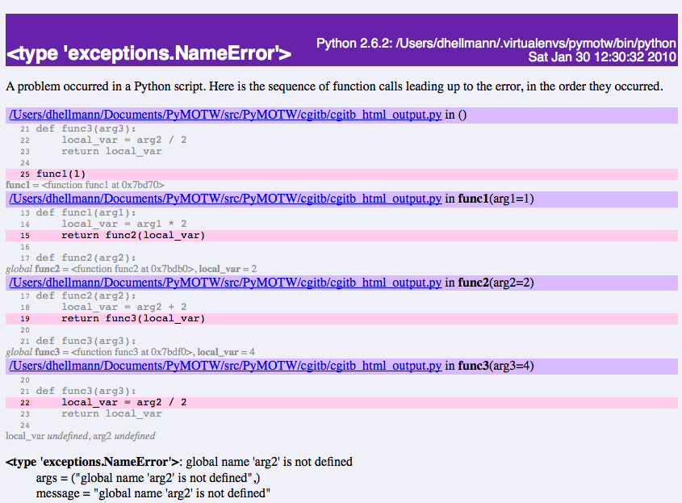

..
    ===================================
    cgitb -- Detailed traceback reports
    ===================================

=====================================
cgitb -- 詳細なトレースバックレポート
=====================================

..
    :synopsis: Mis-named module that provides extended traceback information.

.. module:: cgitb
    :synopsis: 拡張トレースバック情報を提供する名前がよくないモジュール

..
    :Purpose: cgitb provides more detailed traceback information than :mod:`traceback`.
    :Available In: 2.2 and later

:目的: cgitb は :mod:`traceback` よりも詳細なトレースバック情報を提供する
:利用できるバージョン: 2.2 以上

..
    :mod:`cgitb` was originally designed for showing errors and debugging
    information in web applications.  It was later updated to include
    plain-text output as well, but unfortunately wasn't renamed.  This has
    led to obscurity and the module is not used as often as it should be.
    Nonetheless, :mod:`cgitb` is a valuable debugging tool in the standard
    library.

もともと :mod:`cgitb` は、web アプリケーションのエラーとデバッグ情報の表示を目的に設計されていました。後になってプレーンテキストの出力も同様に含めるように拡張されましたが、残念ながら名前は変更されませんでした。この名前は分かり難いので、このモジュールはあまり使われていません。そうとは言え :mod:`cgitb` は標準ライブラリの優れたデバッグツールです。

..
    Standard Traceback Dumps
    ========================

標準トレースバックの出力
========================

..
    Python's default exception handling behavior is to print a *traceback*
    to standard error with the call stack leading up to the error
    position.  This basic output frequently contains enough information to
    understand the cause of the exception and permit a fix.

Python のデフォルトの例外処理の動作は、エラーが発生した箇所へ至るコールスタックと *トレースバック* を標準エラー出力に表示します。この基本的な出力は、例外が発生した原因を理解して、その不具合を修正するのに十分な情報を提供します。

.. include:: cgitb_basic_traceback.py
   :literal:
   :start-after: #end_pymotw_header

..
    The above sample program has a subtle error in :func:`func3()`.

上述したサンプルプログラムは :func:`func3()` に分かり難いエラーがあります。

.. {{{cog
.. cog.out(run_script(cog.inFile, 'cgitb_basic_traceback.py', ignore_error=True))
.. }}}

::

	$ python cgitb_basic_traceback.py
	
	Traceback (most recent call last):
	  File "cgitb_basic_traceback.py", line 22, in <module>
	    func1(1)
	  File "cgitb_basic_traceback.py", line 12, in func1
	    return func2(local_var)
	  File "cgitb_basic_traceback.py", line 16, in func2
	    return func3(local_var)
	  File "cgitb_basic_traceback.py", line 19, in func3
	    local_var = arg2 / 2
	NameError: global name 'arg2' is not defined

.. {{{end}}}

..
    Enabling Detailed Tracebacks
    ============================

詳細なトレースバックを有効にする
================================

..
    While the basic traceback includes enough information for us to spot
    the error, enabling cgitb replaces ``sys.excepthook`` with a function
    that gives extended tracebacks with even more detail.

標準のトレースバックはエラーが発生した箇所を見つけるのに十分な情報を提供しますが、 :mod:`cgitb` を有効にすると ``sys.excepthook`` をさらに詳細なトレースバック情報を出力するように拡張した関数に置き換えてくれます。

.. include:: cgitb_extended_traceback.py
   :literal:
   :start-after: #end_pymotw_header

..
    As you can see below, the error report is much more extensive.  Each
    frame of the stack is listed, along with:

ご覧のように、このエラーレポートはかなり広範囲に及びます。スタックの各フレームが次の内容にそって表示されます。

..
    * the full path to the source file, instead of just the base name
    * the values of the arguments to each function in the stack
    * a few lines of source context from around the line in the error path
    * the values of variables in the expression causing the error

* ファイル名だけではなく、ソースファイルのフルパスを表示する
* スタックの各関数への引数の値を表示する
* エラーパス周辺のソースコンテキストを数行表示する
* エラーを発生させた式の変数の値を表示する

.. {{{cog
.. cog.out(run_script(cog.inFile, 'cgitb_extended_traceback.py', ignore_error=True))
.. }}}

::

	$ python cgitb_extended_traceback.py
	
	<type 'exceptions.NameError'>
	Python 2.7.2: /Users/dhellmann/Envs/pymotw/bin/python
	Thu Feb 21 06:35:39 2013
	
	A problem occurred in a Python script.  Here is the sequence of
	function calls leading up to the error, in the order they occurred.
	
	 /Users/dhellmann/Documents/PyMOTW/src/PyMOTW/cgitb/cgitb_extended_traceback.py in <module>()
	   21 def func3(arg3):
	   22     local_var = arg2 / 2
	   23     return local_var
	   24 
	   25 func1(1)
	func1 = <function func1>
	
	 /Users/dhellmann/Documents/PyMOTW/src/PyMOTW/cgitb/cgitb_extended_traceback.py in func1(arg1=1)
	   13 def func1(arg1):
	   14     local_var = arg1 * 2
	   15     return func2(local_var)
	   16 
	   17 def func2(arg2):
	global func2 = <function func2>
	local_var = 2
	
	 /Users/dhellmann/Documents/PyMOTW/src/PyMOTW/cgitb/cgitb_extended_traceback.py in func2(arg2=2)
	   17 def func2(arg2):
	   18     local_var = arg2 + 2
	   19     return func3(local_var)
	   20 
	   21 def func3(arg3):
	global func3 = <function func3>
	local_var = 4
	
	 /Users/dhellmann/Documents/PyMOTW/src/PyMOTW/cgitb/cgitb_extended_traceback.py in func3(arg3=4)
	   20 
	   21 def func3(arg3):
	   22     local_var = arg2 / 2
	   23     return local_var
	   24 
	local_var undefined
	arg2 undefined
	<type 'exceptions.NameError'>: global name 'arg2' is not defined
	    __class__ = <type 'exceptions.NameError'>
	    __delattr__ = <method-wrapper '__delattr__' of exceptions.NameError object>
	    __dict__ = {}
	    __doc__ = 'Name not found globally.'
	    __format__ = <built-in method __format__ of exceptions.NameError object>
	    __getattribute__ = <method-wrapper '__getattribute__' of exceptions.NameError object>
	    __getitem__ = <method-wrapper '__getitem__' of exceptions.NameError object>
	    __getslice__ = <method-wrapper '__getslice__' of exceptions.NameError object>
	    __hash__ = <method-wrapper '__hash__' of exceptions.NameError object>
	    __init__ = <method-wrapper '__init__' of exceptions.NameError object>
	    __new__ = <built-in method __new__ of type object>
	    __reduce__ = <built-in method __reduce__ of exceptions.NameError object>
	    __reduce_ex__ = <built-in method __reduce_ex__ of exceptions.NameError object>
	    __repr__ = <method-wrapper '__repr__' of exceptions.NameError object>
	    __setattr__ = <method-wrapper '__setattr__' of exceptions.NameError object>
	    __setstate__ = <built-in method __setstate__ of exceptions.NameError object>
	    __sizeof__ = <built-in method __sizeof__ of exceptions.NameError object>
	    __str__ = <method-wrapper '__str__' of exceptions.NameError object>
	    __subclasshook__ = <built-in method __subclasshook__ of type object>
	    __unicode__ = <built-in method __unicode__ of exceptions.NameError object>
	    args = ("global name 'arg2' is not defined",)
	    message = "global name 'arg2' is not defined"
	
	The above is a description of an error in a Python program.  Here is
	the original traceback:
	
	Traceback (most recent call last):
	  File "cgitb_extended_traceback.py", line 25, in <module>
	    func1(1)
	  File "cgitb_extended_traceback.py", line 15, in func1
	    return func2(local_var)
	  File "cgitb_extended_traceback.py", line 19, in func2
	    return func3(local_var)
	  File "cgitb_extended_traceback.py", line 22, in func3
	    local_var = arg2 / 2
	NameError: global name 'arg2' is not defined
	
	

.. {{{end}}}

..
    The end of the output also includes the full details of the exception
    object (in case it has attributes other than ``message`` that would be
    useful for debugging) and the original form of a traceback dump.

この出力の最後の方に、(``message`` 以外のデバッグに役立つ属性を持つ場合は)例外オブジェクトの全ての詳細とオリジナルのトレースバック出力も含みます。

..
    Local Variables in Tracebacks
    =============================

トレースバックのローカル変数
============================

..
    Having access to the variables involved in the error stack can help
    find a logical error that occurs somewhere higher in the stack than
    the line where the actual exception is generated.

エラースタックで実行された変数へアクセスできることは、実際に例外が発生した行よりもスタックの高いところで起こる論理的なエラーを見つけるのに役立ちます。

.. include:: cgitb_local_vars.py
   :literal:
   :start-after: #end_pymotw_header

..
    In the case of this code with a :ref:`ZeroDivisionError
    <exceptions-ZeroDivisionError>`, we can see that the problem is
    introduced in the computation of the value of ``c`` in ``func1()``,
    rather than where the value is used in ``func2()``.

:ref:`ZeroDivisionError <exceptions-ZeroDivisionError>` を発生させるこのサンプルコードでは、 ``func2()`` で使用される値の計算よりも ``func1()`` で ``c`` の値の計算でこの問題が発生することが分かります。

.. {{{cog
.. cog.out(run_script(cog.inFile, 'cgitb_local_vars.py', ignore_error=True))
.. }}}

::

	$ python cgitb_local_vars.py
	
	<type 'exceptions.ZeroDivisionError'>
	Python 2.7.2: /Users/dhellmann/Envs/pymotw/bin/python
	Thu Feb 21 06:35:39 2013
	
	A problem occurred in a Python script.  Here is the sequence of
	function calls leading up to the error, in the order they occurred.
	
	 /Users/dhellmann/Documents/PyMOTW/src/PyMOTW/cgitb/cgitb_local_vars.py in <module>()
	   16 def func1(a, b):
	   17     c = b - 5
	   18     return func2(a, c)
	   19 
	   20 func1(1, 5)
	func1 = <function func1>
	
	 /Users/dhellmann/Documents/PyMOTW/src/PyMOTW/cgitb/cgitb_local_vars.py in func1(a=1, b=5)
	   16 def func1(a, b):
	   17     c = b - 5
	   18     return func2(a, c)
	   19 
	   20 func1(1, 5)
	global func2 = <function func2>
	a = 1
	c = 0
	
	 /Users/dhellmann/Documents/PyMOTW/src/PyMOTW/cgitb/cgitb_local_vars.py in func2(a=1, divisor=0)
	   12 
	   13 def func2(a, divisor):
	   14     return a / divisor
	   15 
	   16 def func1(a, b):
	a = 1
	divisor = 0
	<type 'exceptions.ZeroDivisionError'>: integer division or modulo by zero
	    __class__ = <type 'exceptions.ZeroDivisionError'>
	    __delattr__ = <method-wrapper '__delattr__' of exceptions.ZeroDivisionError object>
	    __dict__ = {}
	    __doc__ = 'Second argument to a division or modulo operation was zero.'
	    __format__ = <built-in method __format__ of exceptions.ZeroDivisionError object>
	    __getattribute__ = <method-wrapper '__getattribute__' of exceptions.ZeroDivisionError object>
	    __getitem__ = <method-wrapper '__getitem__' of exceptions.ZeroDivisionError object>
	    __getslice__ = <method-wrapper '__getslice__' of exceptions.ZeroDivisionError object>
	    __hash__ = <method-wrapper '__hash__' of exceptions.ZeroDivisionError object>
	    __init__ = <method-wrapper '__init__' of exceptions.ZeroDivisionError object>
	    __new__ = <built-in method __new__ of type object>
	    __reduce__ = <built-in method __reduce__ of exceptions.ZeroDivisionError object>
	    __reduce_ex__ = <built-in method __reduce_ex__ of exceptions.ZeroDivisionError object>
	    __repr__ = <method-wrapper '__repr__' of exceptions.ZeroDivisionError object>
	    __setattr__ = <method-wrapper '__setattr__' of exceptions.ZeroDivisionError object>
	    __setstate__ = <built-in method __setstate__ of exceptions.ZeroDivisionError object>
	    __sizeof__ = <built-in method __sizeof__ of exceptions.ZeroDivisionError object>
	    __str__ = <method-wrapper '__str__' of exceptions.ZeroDivisionError object>
	    __subclasshook__ = <built-in method __subclasshook__ of type object>
	    __unicode__ = <built-in method __unicode__ of exceptions.ZeroDivisionError object>
	    args = ('integer division or modulo by zero',)
	    message = 'integer division or modulo by zero'
	
	The above is a description of an error in a Python program.  Here is
	the original traceback:
	
	Traceback (most recent call last):
	  File "cgitb_local_vars.py", line 20, in <module>
	    func1(1, 5)
	  File "cgitb_local_vars.py", line 18, in func1
	    return func2(a, c)
	  File "cgitb_local_vars.py", line 14, in func2
	    return a / divisor
	ZeroDivisionError: integer division or modulo by zero
	
	

.. {{{end}}}

..
    The code in :mod:`cgitb` that examines the variables used in the stack
    frame leading to the error is smart enough to evaluate object
    attributes to display them, too.

エラーを引き起こすスタックフレームで使用される変数を調べる :mod:`cgitb` のコードは、オブジェクトの属性を評価して表示するのにも十分実用できます。

.. include:: cgitb_with_classes.py
   :literal:
   :start-after: #end_pymotw_header

..
    Here we see that ``self.a`` and ``self.b`` are involved in the
    error-prone code.

ここでは ``self.a`` と ``self.b`` が、エラーの発生し易いコードで実行されます。

.. {{{cog
.. cog.out(run_script(cog.inFile, 'cgitb_with_classes.py', ignore_error=True))
.. }}}

::

	$ python cgitb_with_classes.py
	
	<type 'exceptions.ZeroDivisionError'>
	Python 2.7.2: /Users/dhellmann/Envs/pymotw/bin/python
	Thu Feb 21 06:35:39 2013
	
	A problem occurred in a Python script.  Here is the sequence of
	function calls leading up to the error, in the order they occurred.
	
	 /Users/dhellmann/Documents/PyMOTW/src/PyMOTW/cgitb/cgitb_with_classes.py in <module>()
	   24         return
	   25 
	   26 o = BrokenClass(1, 0)
	   27 
	   28 
	o undefined
	BrokenClass = <class '__main__.BrokenClass'>
	
	 /Users/dhellmann/Documents/PyMOTW/src/PyMOTW/cgitb/cgitb_with_classes.py in __init__(self=<__main__.BrokenClass object>, a=1, b=0)
	   21         self.b = b
	   22         self.c = self.a * self.b
	   23         self.d = self.a / self.b
	   24         return
	   25 
	self = <__main__.BrokenClass object>
	self.d undefined
	self.a = 1
	self.b = 0
	<type 'exceptions.ZeroDivisionError'>: integer division or modulo by zero
	    __class__ = <type 'exceptions.ZeroDivisionError'>
	    __delattr__ = <method-wrapper '__delattr__' of exceptions.ZeroDivisionError object>
	    __dict__ = {}
	    __doc__ = 'Second argument to a division or modulo operation was zero.'
	    __format__ = <built-in method __format__ of exceptions.ZeroDivisionError object>
	    __getattribute__ = <method-wrapper '__getattribute__' of exceptions.ZeroDivisionError object>
	    __getitem__ = <method-wrapper '__getitem__' of exceptions.ZeroDivisionError object>
	    __getslice__ = <method-wrapper '__getslice__' of exceptions.ZeroDivisionError object>
	    __hash__ = <method-wrapper '__hash__' of exceptions.ZeroDivisionError object>
	    __init__ = <method-wrapper '__init__' of exceptions.ZeroDivisionError object>
	    __new__ = <built-in method __new__ of type object>
	    __reduce__ = <built-in method __reduce__ of exceptions.ZeroDivisionError object>
	    __reduce_ex__ = <built-in method __reduce_ex__ of exceptions.ZeroDivisionError object>
	    __repr__ = <method-wrapper '__repr__' of exceptions.ZeroDivisionError object>
	    __setattr__ = <method-wrapper '__setattr__' of exceptions.ZeroDivisionError object>
	    __setstate__ = <built-in method __setstate__ of exceptions.ZeroDivisionError object>
	    __sizeof__ = <built-in method __sizeof__ of exceptions.ZeroDivisionError object>
	    __str__ = <method-wrapper '__str__' of exceptions.ZeroDivisionError object>
	    __subclasshook__ = <built-in method __subclasshook__ of type object>
	    __unicode__ = <built-in method __unicode__ of exceptions.ZeroDivisionError object>
	    args = ('integer division or modulo by zero',)
	    message = 'integer division or modulo by zero'
	
	The above is a description of an error in a Python program.  Here is
	the original traceback:
	
	Traceback (most recent call last):
	  File "cgitb_with_classes.py", line 26, in <module>
	    o = BrokenClass(1, 0)
	  File "cgitb_with_classes.py", line 23, in __init__
	    self.d = self.a / self.b
	ZeroDivisionError: integer division or modulo by zero
	
	

.. {{{end}}}

..
    Adding More Context
    ===================

もっとコンテキストを追加する
============================

..
    Suppose your function includes a lot of inline comments, whitespace,
    or other code that makes it very long.  Having the default of 5 lines
    of context may not be enough help in that case, if the body of the
    function is pushed out of the code window displayed.  Using a larger
    context value when enabling cgitb gets around this.

たくさんのコメント、スペース、余分なコードがある長い関数があると仮定してください。その場合、デフォルトで表示される5行のコンテキストだと、ウィンドウに表示されるコードから関数の主要部分が押し出されて必要な情報がないかもしれません。 :mod:`cgitb` を利用するときに *context* に大きな値をセットすると、そういった問題に対応できます。

.. include:: cgitb_more_context.py
   :literal:
   :start-after: #end_pymotw_header

..
    You can pass *context* to :func:`enable()` to control the amount of
    code displayed for each line of the traceback.

トレースバックに表示されるコード量を制御するために *context* を :func:`enable()` に渡します。

.. {{{cog
.. cog.out(run_script(cog.inFile, 'cgitb_more_context.py 5', ignore_error=True))
.. }}}

::

	$ python cgitb_more_context.py 5
	
	<type 'exceptions.ZeroDivisionError'>
	Python 2.7.2: /Users/dhellmann/Envs/pymotw/bin/python
	Thu Feb 21 06:35:39 2013
	
	A problem occurred in a Python script.  Here is the sequence of
	function calls leading up to the error, in the order they occurred.
	
	 /Users/dhellmann/Documents/PyMOTW/src/PyMOTW/cgitb/cgitb_more_context.py in <module>()
	   24     # goes
	   25     # here.
	   26     return func2(a, c)
	   27 
	   28 func1(1, 5)
	func1 = <function func1>
	
	 /Users/dhellmann/Documents/PyMOTW/src/PyMOTW/cgitb/cgitb_more_context.py in func1(a=1, b=5)
	   24     # goes
	   25     # here.
	   26     return func2(a, c)
	   27 
	   28 func1(1, 5)
	global func2 = <function func2>
	a = 1
	c = 0
	
	 /Users/dhellmann/Documents/PyMOTW/src/PyMOTW/cgitb/cgitb_more_context.py in func2(a=1, divisor=0)
	   15 
	   16 def func2(a, divisor):
	   17     return a / divisor
	   18 
	   19 def func1(a, b):
	a = 1
	divisor = 0
	<type 'exceptions.ZeroDivisionError'>: integer division or modulo by zero
	    __class__ = <type 'exceptions.ZeroDivisionError'>
	    __delattr__ = <method-wrapper '__delattr__' of exceptions.ZeroDivisionError object>
	    __dict__ = {}
	    __doc__ = 'Second argument to a division or modulo operation was zero.'
	    __format__ = <built-in method __format__ of exceptions.ZeroDivisionError object>
	    __getattribute__ = <method-wrapper '__getattribute__' of exceptions.ZeroDivisionError object>
	    __getitem__ = <method-wrapper '__getitem__' of exceptions.ZeroDivisionError object>
	    __getslice__ = <method-wrapper '__getslice__' of exceptions.ZeroDivisionError object>
	    __hash__ = <method-wrapper '__hash__' of exceptions.ZeroDivisionError object>
	    __init__ = <method-wrapper '__init__' of exceptions.ZeroDivisionError object>
	    __new__ = <built-in method __new__ of type object>
	    __reduce__ = <built-in method __reduce__ of exceptions.ZeroDivisionError object>
	    __reduce_ex__ = <built-in method __reduce_ex__ of exceptions.ZeroDivisionError object>
	    __repr__ = <method-wrapper '__repr__' of exceptions.ZeroDivisionError object>
	    __setattr__ = <method-wrapper '__setattr__' of exceptions.ZeroDivisionError object>
	    __setstate__ = <built-in method __setstate__ of exceptions.ZeroDivisionError object>
	    __sizeof__ = <built-in method __sizeof__ of exceptions.ZeroDivisionError object>
	    __str__ = <method-wrapper '__str__' of exceptions.ZeroDivisionError object>
	    __subclasshook__ = <built-in method __subclasshook__ of type object>
	    __unicode__ = <built-in method __unicode__ of exceptions.ZeroDivisionError object>
	    args = ('integer division or modulo by zero',)
	    message = 'integer division or modulo by zero'
	
	The above is a description of an error in a Python program.  Here is
	the original traceback:
	
	Traceback (most recent call last):
	  File "cgitb_more_context.py", line 28, in <module>
	    func1(1, 5)
	  File "cgitb_more_context.py", line 26, in func1
	    return func2(a, c)
	  File "cgitb_more_context.py", line 17, in func2
	    return a / divisor
	ZeroDivisionError: integer division or modulo by zero
	
	

.. {{{end}}}

..
    Increasing the value gets us enough of the function that we can spot
    the problem in the code, again.

値を増やして再度実行すると、コード内の問題を見つけるのに十分な関数の情報を取得できます。

.. {{{cog
.. cog.out(run_script(cog.inFile, 'cgitb_more_context.py 10', ignore_error=True))
.. }}}

::

	$ python cgitb_more_context.py 10
	
	<type 'exceptions.ZeroDivisionError'>
	Python 2.7.2: /Users/dhellmann/Envs/pymotw/bin/python
	Thu Feb 21 06:35:39 2013
	
	A problem occurred in a Python script.  Here is the sequence of
	function calls leading up to the error, in the order they occurred.
	
	 /Users/dhellmann/Documents/PyMOTW/src/PyMOTW/cgitb/cgitb_more_context.py in <module>()
	   19 def func1(a, b):
	   20     c = b - 5
	   21     # Really
	   22     # long
	   23     # comment
	   24     # goes
	   25     # here.
	   26     return func2(a, c)
	   27 
	   28 func1(1, 5)
	func1 = <function func1>
	
	 /Users/dhellmann/Documents/PyMOTW/src/PyMOTW/cgitb/cgitb_more_context.py in func1(a=1, b=5)
	   19 def func1(a, b):
	   20     c = b - 5
	   21     # Really
	   22     # long
	   23     # comment
	   24     # goes
	   25     # here.
	   26     return func2(a, c)
	   27 
	   28 func1(1, 5)
	global func2 = <function func2>
	a = 1
	c = 0
	
	 /Users/dhellmann/Documents/PyMOTW/src/PyMOTW/cgitb/cgitb_more_context.py in func2(a=1, divisor=0)
	   12 
	   13 context_length = int(sys.argv[1])
	   14 cgitb.enable(format='text', context=context_length)
	   15 
	   16 def func2(a, divisor):
	   17     return a / divisor
	   18 
	   19 def func1(a, b):
	   20     c = b - 5
	   21     # Really
	a = 1
	divisor = 0
	<type 'exceptions.ZeroDivisionError'>: integer division or modulo by zero
	    __class__ = <type 'exceptions.ZeroDivisionError'>
	    __delattr__ = <method-wrapper '__delattr__' of exceptions.ZeroDivisionError object>
	    __dict__ = {}
	    __doc__ = 'Second argument to a division or modulo operation was zero.'
	    __format__ = <built-in method __format__ of exceptions.ZeroDivisionError object>
	    __getattribute__ = <method-wrapper '__getattribute__' of exceptions.ZeroDivisionError object>
	    __getitem__ = <method-wrapper '__getitem__' of exceptions.ZeroDivisionError object>
	    __getslice__ = <method-wrapper '__getslice__' of exceptions.ZeroDivisionError object>
	    __hash__ = <method-wrapper '__hash__' of exceptions.ZeroDivisionError object>
	    __init__ = <method-wrapper '__init__' of exceptions.ZeroDivisionError object>
	    __new__ = <built-in method __new__ of type object>
	    __reduce__ = <built-in method __reduce__ of exceptions.ZeroDivisionError object>
	    __reduce_ex__ = <built-in method __reduce_ex__ of exceptions.ZeroDivisionError object>
	    __repr__ = <method-wrapper '__repr__' of exceptions.ZeroDivisionError object>
	    __setattr__ = <method-wrapper '__setattr__' of exceptions.ZeroDivisionError object>
	    __setstate__ = <built-in method __setstate__ of exceptions.ZeroDivisionError object>
	    __sizeof__ = <built-in method __sizeof__ of exceptions.ZeroDivisionError object>
	    __str__ = <method-wrapper '__str__' of exceptions.ZeroDivisionError object>
	    __subclasshook__ = <built-in method __subclasshook__ of type object>
	    __unicode__ = <built-in method __unicode__ of exceptions.ZeroDivisionError object>
	    args = ('integer division or modulo by zero',)
	    message = 'integer division or modulo by zero'
	
	The above is a description of an error in a Python program.  Here is
	the original traceback:
	
	Traceback (most recent call last):
	  File "cgitb_more_context.py", line 28, in <module>
	    func1(1, 5)
	  File "cgitb_more_context.py", line 26, in func1
	    return func2(a, c)
	  File "cgitb_more_context.py", line 17, in func2
	    return a / divisor
	ZeroDivisionError: integer division or modulo by zero
	
	

.. {{{end}}}

..
    Exception Properties
    ====================

例外プロパティ
==============

..
    In addition to the local variables from each stack frame, :mod:`cgitb`
    shows all properties of the exception object.  If you have a custom
    exception type with extra properties, they are printed as part of the
    error report.

各スタックフレームのローカル変数に加えて、 :mod:`cgitb` は例外オブジェクトの全てのプロパティを表示します。拡張プロパティをもつカスタム例外を扱う場合、それはエラーレポートの一部に表示されます。

.. include:: cgitb_exception_properties.py
   :literal:
   :start-after: #end_pymotw_header

..
    In this example, the *bad_value* property is included along with the
    standard *message* and *args* values.

このサンプルでは、 *bad_value* プロパティが標準の *message* と *args* の間にあります。

.. {{{cog
.. cog.out(run_script(cog.inFile, 'cgitb_exception_properties.py', ignore_error=True))
.. }}}

::

	$ python cgitb_exception_properties.py
	
	<class '__main__.MyException'>
	Python 2.7.2: /Users/dhellmann/Envs/pymotw/bin/python
	Thu Feb 21 06:35:39 2013
	
	A problem occurred in a Python script.  Here is the sequence of
	function calls leading up to the error, in the order they occurred.
	
	 /Users/dhellmann/Documents/PyMOTW/src/PyMOTW/cgitb/cgitb_exception_properties.py in <module>()
	   18         self.bad_value = bad_value
	   19         Exception.__init__(self, message)
	   20         return
	   21 
	   22 raise MyException('Normal message', bad_value=99)
	MyException = <class '__main__.MyException'>
	bad_value undefined
	<class '__main__.MyException'>: Normal message
	    __class__ = <class '__main__.MyException'>
	    __delattr__ = <method-wrapper '__delattr__' of MyException object>
	    __dict__ = {'bad_value': 99}
	    __doc__ = 'Add extra properties to a special exception\n    '
	    __format__ = <built-in method __format__ of MyException object>
	    __getattribute__ = <method-wrapper '__getattribute__' of MyException object>
	    __getitem__ = <method-wrapper '__getitem__' of MyException object>
	    __getslice__ = <method-wrapper '__getslice__' of MyException object>
	    __hash__ = <method-wrapper '__hash__' of MyException object>
	    __init__ = <bound method MyException.__init__ of MyException('Normal message',)>
	    __module__ = '__main__'
	    __new__ = <built-in method __new__ of type object>
	    __reduce__ = <built-in method __reduce__ of MyException object>
	    __reduce_ex__ = <built-in method __reduce_ex__ of MyException object>
	    __repr__ = <method-wrapper '__repr__' of MyException object>
	    __setattr__ = <method-wrapper '__setattr__' of MyException object>
	    __setstate__ = <built-in method __setstate__ of MyException object>
	    __sizeof__ = <built-in method __sizeof__ of MyException object>
	    __str__ = <method-wrapper '__str__' of MyException object>
	    __subclasshook__ = <built-in method __subclasshook__ of type object>
	    __unicode__ = <built-in method __unicode__ of MyException object>
	    __weakref__ = None
	    args = ('Normal message',)
	    bad_value = 99
	    message = 'Normal message'
	
	The above is a description of an error in a Python program.  Here is
	the original traceback:
	
	Traceback (most recent call last):
	  File "cgitb_exception_properties.py", line 22, in <module>
	    raise MyException('Normal message', bad_value=99)
	MyException: Normal message
	
	

.. {{{end}}}

..
    Logging Tracebacks
    ==================

トレースバックをロギングする
============================

..
    For many situations, printing the traceback details to standard error
    is the best resolution.  In a production system, however, logging the
    errors is even better.  :func:`enable()` includes an optional
    argument, *logdir*, to enable error logging.  When a directory name is
    provided, each exception is logged to its own file in the given
    directory.

よくある環境では、トレースバック情報の詳細は標準エラー出力に表示することが最も良い方法です。しかし、本番環境では、エラーをロギングする方がもっと良いです。 :func:`enable()` は、エラーロギングを有効にする *logdir* というオプション引数を取ります。ディレクトリ名を指定すると、それぞれの例外はそのディレクトリのログファイルにロギングされます。

.. include:: cgitb_log_exception.py
   :literal:
   :start-after: #end_pymotw_header

..
    Even though the error display is suppressed, a message is printed
    describing where to go to find the error log.

エラーの出力は抑制されますが、そのエラーメッセージはエラーログを探しに行くと見つけられます。

.. {{{cog
.. path('PyMOTW/cgitb/LOGS').rmtree()
.. sh('mkdir -p PyMOTW/cgitb/LOGS')
.. cog.out(run_script(cog.inFile, 'cgitb_log_exception.py', ignore_error=True))
.. cog.out(run_script(cog.inFile, 'ls LOGS', interpreter=None, include_prefix=False))
.. cog.out(run_script(cog.inFile, 'cat LOGS/*.txt', interpreter=None, include_prefix=False))
.. }}}

::

	$ python cgitb_log_exception.py
	
	
A problem occurred in a Python script.
	
 /Users/dhellmann/Documents/PyMOTW/src/PyMOTW/cgitb/LOGS/tmpju23ip.txt contains the description of this error.

	$ ls LOGS
	
	tmpju23ip.txt

	$ cat LOGS/*.txt
	
	<type 'exceptions.ZeroDivisionError'>
	Python 2.7.2: /Users/dhellmann/Envs/pymotw/bin/python
	Thu Feb 21 06:35:40 2013
	
	A problem occurred in a Python script.  Here is the sequence of
	function calls leading up to the error, in the order they occurred.
	
	 /Users/dhellmann/Documents/PyMOTW/src/PyMOTW/cgitb/cgitb_log_exception.py in <module>()
	   21 def func1(a, b):
	   22     c = b - 5
	   23     return func2(a, c)
	   24 
	   25 func1(1, 5)
	func1 = <function func1>
	
	 /Users/dhellmann/Documents/PyMOTW/src/PyMOTW/cgitb/cgitb_log_exception.py in func1(a=1, b=5)
	   21 def func1(a, b):
	   22     c = b - 5
	   23     return func2(a, c)
	   24 
	   25 func1(1, 5)
	global func2 = <function func2>
	a = 1
	c = 0
	
	 /Users/dhellmann/Documents/PyMOTW/src/PyMOTW/cgitb/cgitb_log_exception.py in func2(a=1, divisor=0)
	   17 
	   18 def func2(a, divisor):
	   19     return a / divisor
	   20 
	   21 def func1(a, b):
	a = 1
	divisor = 0
	<type 'exceptions.ZeroDivisionError'>: integer division or modulo by zero
	    __class__ = <type 'exceptions.ZeroDivisionError'>
	    __delattr__ = <method-wrapper '__delattr__' of exceptions.ZeroDivisionError object>
	    __dict__ = {}
	    __doc__ = 'Second argument to a division or modulo operation was zero.'
	    __format__ = <built-in method __format__ of exceptions.ZeroDivisionError object>
	    __getattribute__ = <method-wrapper '__getattribute__' of exceptions.ZeroDivisionError object>
	    __getitem__ = <method-wrapper '__getitem__' of exceptions.ZeroDivisionError object>
	    __getslice__ = <method-wrapper '__getslice__' of exceptions.ZeroDivisionError object>
	    __hash__ = <method-wrapper '__hash__' of exceptions.ZeroDivisionError object>
	    __init__ = <method-wrapper '__init__' of exceptions.ZeroDivisionError object>
	    __new__ = <built-in method __new__ of type object>
	    __reduce__ = <built-in method __reduce__ of exceptions.ZeroDivisionError object>
	    __reduce_ex__ = <built-in method __reduce_ex__ of exceptions.ZeroDivisionError object>
	    __repr__ = <method-wrapper '__repr__' of exceptions.ZeroDivisionError object>
	    __setattr__ = <method-wrapper '__setattr__' of exceptions.ZeroDivisionError object>
	    __setstate__ = <built-in method __setstate__ of exceptions.ZeroDivisionError object>
	    __sizeof__ = <built-in method __sizeof__ of exceptions.ZeroDivisionError object>
	    __str__ = <method-wrapper '__str__' of exceptions.ZeroDivisionError object>
	    __subclasshook__ = <built-in method __subclasshook__ of type object>
	    __unicode__ = <built-in method __unicode__ of exceptions.ZeroDivisionError object>
	    args = ('integer division or modulo by zero',)
	    message = 'integer division or modulo by zero'
	
	The above is a description of an error in a Python program.  Here is
	the original traceback:
	
	Traceback (most recent call last):
	  File "cgitb_log_exception.py", line 25, in <module>
	    func1(1, 5)
	  File "cgitb_log_exception.py", line 23, in func1
	    return func2(a, c)
	  File "cgitb_log_exception.py", line 19, in func2
	    return a / divisor
	ZeroDivisionError: integer division or modulo by zero
	

.. {{{end}}}

..
    HTML Output
    ===========

HTML 出力
=========

..
    Because :mod:`cgitb` was originally developed for handling exceptions
    in web apps, no discussion would be complete without an example of the
    HTML output it produces.

:mod:`cgitb` は、もともと web アプリケーションの例外を処理するために開発されていたので、HTML 出力のサンプルを紹介しないわけにはいきません。

.. include:: cgitb_html_output.py
   :literal:
   :start-after: #end_pymotw_header

..
    By leaving out the *format* argument (or specifying ``html``), the
    traceback format changes to HTML output.

*format* 引数を取り除く(または ``html`` を指定する)ことで、トレースバック情報の出力フォーマットを HTML に変更します。

.. seealso::

    `cgitb <http://docs.python.org/library/cgitb.html>`_
        .. The standard library documentation for this module.

        本モジュールの標準ライブラリドキュメント

    :mod:`traceback`
        .. Standard library module for working with tracebacks.

        トレースバック情報を扱う標準ライブラリ

    :mod:`inspect`
        .. The inspect module includes more functions for examining the
           stack.

        スタックを調べる関数を提供する inspect モジュール

    :mod:`sys`
        .. The sys module provides access to the current exception value
           and the ``excepthook`` handler invoked when an exception
           occurs.

        カレントの実行値と例外が発生したときに実行される ``excepthook`` ハンドラへのアクセスを提供する sys モジュール

    `Improved traceback module <http://thread.gmane.org/gmane.comp.python.devel/110326>`_
        .. Python-dev discussion of improvements to the traceback module
           and related enhancements other developers use locally.

        traceback モジュールの改善と開発者が普段行っている機能拡張に関する Python-dev の議論
